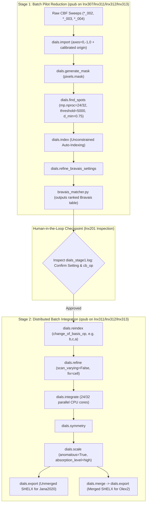

# CHESS DIALS Data Reduction & Crystallographic Refinement Pipeline (`chess-dials-reduction`)

This skill automates the data reduction of single-crystal synchrotron X-ray diffraction datasets collected on the Pilatus 6M detector at the **CHESS ID4B/QM2 beamline** using the **DIALS** (Diffraction Integration for Advanced Light Sources) processing framework.

The output of this pipeline is a dual reflection bundle (`for_refinement/`) containing:
1. **Unmerged SHELX (`unmerged.ins`, `unmerged.hkl`)**: Suitable for **Jana2020** (absorption modeling, twin refinement, modulated structures).
2. **Merged SHELX (`merged.ins`, `merged.hkl`)**: Suitable for **Olex2 / SHELXL** (rapid structure solution and standard least-squares refinement).

---

## 1. Environment & Remote Compute Etiquette

### 1.1 Cluster Etiquette: ZERO Compute on Login Node (`lnx201`)
> [!CAUTION]
> **STRICT PROHIBITION ON DATA PROCESSING ON `lnx201` (LOGIN NODE)**
>
> `lnx201` is a shared interactive login gateway for all CLASSE/CHESS beamline users. **NO data processing, spot finding (`dials.find_spots`), indexing (`dials.index`), mask conversions, refinement, or integration may be run directly on `lnx201`.**
> 
> - **Permitted on `lnx201`**: Filesystem navigation, reading/editing scripts, checking logs (`tail -f`), monitoring queues (`qstat`), and submitting jobs (`qsub`).
> - **Mandatory Compute Pattern**:
>   - **Batch Execution (`qsub`)**: BOTH Stage 1 (pilot import, spotfinding, indexing, Bravais settings) and Stage 2 (reindexing, refinement, integration, scaling, export) **MUST be submitted as SGE batch jobs** to compute nodes (`all.q@lnx307*`, `lnx311*`, `lnx312*`, `lnx313*`).
>   - **Interactive Compute (`qrsh`)**: If interactive debugging or inspection is strictly required, the user or agent must request an interactive allocation via `qrsh -q interactive.q -l mem_free=64G -pe sge_pe 8` and execute commands **only after the shell transitions to the allocated compute worker node**.

### 1.2 Software & Environment
On CLASSE cluster compute nodes (`lnx307`, `lnx311`, `lnx312`, `lnx313`), DIALS is activated via:
```bash
source /nfs/chess/sw/dials_sgomezalvarado/dials_env.sh
```
* Python tools interacting with DIALS internal C++ data structures (`scitbx.array_family.flex`, `dxtbx`) must be executed via `dials.python`.

### 1.3 Laboratory Frame & Goniometer Geometry
At CHESS ID4B/QM2 with the Pilatus 6M detector in transmission geometry, the rotation axis in the laboratory coordinate system must be explicitly passed during import:
```text
geometry.goniometer.axes=0,-1,0
```

### 1.4 Critical Detector Calibration & Panel Origin
> [!IMPORTANT]
> **Raw Pilatus 6M CBF Headers Contain Stale Beam Center Values!**
> - The mini-CBF header written by the detector computer frequently records a default uncalibrated beam centre: $(334.54, 433.44)\text{ mm}$ ($(1945, 2520)\text{ px}$).
> - The true calibrated transmission beam centre from the pyFAI calibration (`ceO2_15keV_trans.poni`) is:
>   $$\text{Beam Centre} = (208.32, 205.76)\text{ mm} \quad ((1211.2, 1196.3)\text{ px}), \quad \text{Distance} = 499.43\text{ mm}$$
> - **Converting pyFAI PONI to DIALS Panel Origin**:
>   In pyFAI (C-order, meters): $Poni_1$ is slow/Y axis, $Poni_2$ is fast/X axis, and $Distance$ is sample-to-detector distance.
>   In DIALS (laboratory frame, millimeters):
>   $$\text{origin} = (-Poni_2 \times 1000, \, +Poni_1 \times 1000, \, -Distance \times 1000)$$
>   *Example:* For `ceO2_15keV_trans.poni` ($Poni_1=0.205764$, $Poni_2=0.208324$, $Distance=0.499430$):
>   ```text
>   geometry.detector.panel.origin="-208.324,205.764,-499.430"
>   ```
> - **Impact of Omission**: If this calibrated origin is omitted, DIALS attempts to fit spot centroids against predictions offset by $126\text{ mm}$. Mosaicity artificially inflates to $>2.5^\circ$, shoeboxes expand to $1583 \times 1646\text{ px} \times 295\text{ frames}$, and `dials.integrate` crashes with a catastrophic **`MemoryError` (180 GB shoebox memory)**.

---

## 2. Directory Structure & File Conventions

The DIALS reduction pipeline strictly mirrors the beamline's parallel directory hierarchy:

- **Raw CBF Scans**:
  ```text
  /nfs/chess/id4b/{cycle}/{experiment}/raw6M/{sample_name}/{sample_id}/{temp}/{scan_folder}/
  ```
  *Example:* `/nfs/chess/id4b/2026-2/gomez-al-4850-a/raw6M/K2Co2TeO6/KCTO-1/300/K2Co2TeO6_002/`
- **DIALS Processed Output**:
  ```text
  /nfs/chess/id4baux/{cycle}/{experiment}/dials/{sample_name}/{sample_id}/{temp}/
  ```
  *Example:* `/nfs/chess/id4baux/2026-2/gomez-al-4850-a/dials/K2Co2TeO6/KCTO-1/300/`
- **Beamline Calibrations**:
  ```text
  /nfs/chess/id4baux/{cycle}/{experiment}/calibrations/
  ```
  *Files:* `mask_trans.edf` (bad pixel/beamstop mask), `ceO2_15keV_trans.poni`.
- **Final Refinement Output Folder**:
  ```text
  /nfs/chess/id4baux/{cycle}/{experiment}/dials/{sample_name}/{sample_id}/{temp}/for_refinement/
  ```

---

## 3. Two-Stage Pipeline Architecture (100% SGE Batch Compute)



---

## 4. Execution Workflow

### 4.1 Stage 1: Batch Pilot Import, Spotfinding, Indexing, and Bravais Evaluation

Submit Stage 1 as an SGE batch job from `lnx201` targeting compute nodes:

```bash
qsub -q 'all.q@lnx307*,all.q@lnx311*,all.q@lnx312*,all.q@lnx313*' \
     -l mem_free=64G -pe sge_pe 24 \
     example_job_scripts/dials-stage1-template.sh \
     "/nfs/chess/id4baux/{cycle}/{experiment}/dials/{sample}/{sample_id}/{temp}" \
     "/nfs/chess/id4b/{cycle}/{experiment}/raw6M/{sample}/{sample_id}/{temp}/scan_002" \
     "/nfs/chess/id4baux/{cycle}/{experiment}/calibrations/ceO2_15keV_trans.poni" \
     "/nfs/chess/id4baux/{cycle}/{experiment}/calibrations/mask_trans.edf" \
     "a,b,c,alpha,beta,gamma" \
     "<SpaceGroup>"
```

#### Under the Hood on the Allocated Compute Node:
1. **Calibrated Import**:
   Imports raw frames while overriding the stale detector origin with the true beam center from the PONI file:
   ```bash
   dials.import path_to_scan/*.cbf \
       geometry.detector.panel.origin="-208.324,205.764,-499.430" \
       geometry.goniometer.axes=0,-1,0
   ```
2. **Detector Masking**:
   Generates `pixels.mask` using detector module gap geometry and merges with the beamline `mask_trans.edf` mask:
   ```bash
   dials.generate_mask imported.expt output.mask=pixels.mask
   ```
3. **Multi-Threaded Spot Finding**:
   Finds diffraction peak centroids using beamline-calibrated thresholding across 24 parallel cores:
   ```bash
   dials.find_spots find_spots.phil imported.expt mask=pixels.mask spotfinder.filter.d_min=0.75 mp.nproc=24
   ```
4. **Unconstrained Auto-Indexing**:
   > [!TIP]
   > **Do Not Constrain Symmetry During Initial Indexing on Modulated / Superstructure Crystals!**
   > Systems with supercells (e.g. KCTO $12 \times 12$ supercell where $a'=62.5\text{ \AA}$) will be falsely rejected if constrained to the subcell ($5.22\text{ \AA}$). Always run unconstrained auto-indexing:
   ```bash
   dials.index imported.expt strong.refl
   ```
   Unconstrained indexing with calibrated geometry yields sub-pixel RMSDs ($<1.3\text{ px}$) and indexes $>65\%$ of reflections.
5. **Bravais Setting Scoring**:
   Executes `dials.refine_bravais_settings indexed.expt indexed.refl`, then runs `bravais_matcher.py` to rank candidate Bravais settings.

---

### 4.2 Human-in-the-Loop Checkpoint: Bravais Selection Gate
Inspect `dials_stage1.log` from `lnx201` and present the evaluated Bravais table to the user:
```text
Sol  Fit      RMSD   CC           Lattice  Unit Cell                                  cb_op           Score 
---------------------------------------------------------------------------------------------------------------
 12  0.2327   0.378  0.033/0.125  hP       62.53  62.53  12.61  90.0  90.0 120.0       b,c,a           0.055 
 11  0.2327   0.373  0.116/0.899  oC       62.51 108.33  12.61  90.0  90.0  90.0       b,b+2*c,a       ...
```
* **Required Confirmation**:
  1. Setting number (e.g. `12`).
  2. Change of basis operator (`cb_op`, e.g. `b,c,a`). When DIALS indexes with $a$ along the hexagonal $c$-axis, `cb_op = b,c,a` permutes the axes back into the standard hexagonal setting ($a=b=62.53\text{ \AA}, c=12.61\text{ \AA}$).

---

### 4.3 Stage 2: Batch Integration, Scaling, and Dual Export
Submit the Stage 2 batch job to Sun Grid Engine (`qsub`):

```bash
qsub -q 'all.q@lnx307*,all.q@lnx311*,all.q@lnx312*,all.q@lnx313*' \
     -l mem_free=120G -pe sge_pe 24 \
     example_job_scripts/dials-stage2-template.sh \
     "/nfs/chess/id4baux/{cycle}/{experiment}/dials/{sample}/{sample_id}/{temp}" \
     "12" \
     "b,c,a" \
     "K2Co2TeO6"
```

#### Under the Hood on the Allocated Compute Node:
1. **Reindexing to Standard Setting**:
   ```bash
   dials.reindex indexed.refl change_of_basis_op=b,c,a output.reflections=reindexed.refl
   ```
2. **Static Refinement (Fixed Unit Cell)**:
   > [!IMPORTANT]
   > Always specify `scan_varying=False` and `refinement.parameterisation.crystal.fix=cell` before integration. Unconstrained scan-varying refinement causes unit cell parameter drift and artificial mosaicity inflation.
   ```bash
   dials.refine bravais_setting_12.expt reindexed.refl \
       scan_varying=False \
       refinement.parameterisation.crystal.fix=cell
   ```
3. **Multi-Threaded 3D Profile Integration**:
   ```bash
   dials.integrate refined.expt refined.refl nproc=24
   ```
4. **Symmetry Determination & Anisotropic Absorption Caveat**:
   ```bash
   dials.symmetry integrated.expt integrated.refl
   ```
   > [!WARNING]
   > **Beware of False Symmetry Breaking from Anisotropic Absorption / Crystal Morphology!**
   > - `dials.symmetry` evaluates Laue group correlation coefficients on **unscaled, uncorrected raw intensities** *before* any absorption surface or angle-dependent scale model is applied.
   > - In crystals with anisotropic shapes (e.g. flat plates, needles) and significant absorption (transition metals, heavy elements), reflections related by high-order rotation axes (3-fold, 4-fold, 6-fold) are measured at spindle angles separated by $90^\circ$ or $120^\circ$. Differential path lengths cause severe intensity discrepancies, falsely cratering raw correlation coefficients down to $\text{CC} < 0.25$.
   > - Consequently, `dials.symmetry` may reject the true high-symmetry Laue group (e.g. hexagonal $P6/mmm$) and settle on an orthorhombic or monoclinic subgroup (e.g. $Cmmm$ / $C222$).
   > - **Actionable Rule**: Whenever the metric unit cell is pseudo-hexagonal ($b_{\text{ortho}} \approx \sqrt{3}a_{\text{ortho}}$) or pseudo-tetragonal, **never blindly accept the lower-symmetry assignment without testing high-symmetry scaling**. Reindex to the candidate high-symmetry space group (`dials.reindex ... space_group=<HighSym>`) and run `dials.scale` with `physical.absorption_level=high`. If the data scales cleanly with comparable $R_{\text{merge}}$ and high $\text{CC}_{1/2}$, the apparent symmetry breaking was an absorption artifact. Generate refinement bundles for both space groups.
5. **Multi-Sweep Scaling & Absorption Correction**:
   ```bash
   dials.scale symmetrized.expt symmetrized.refl \
       overwrite_existing_models=True \
       absorption_level=high \
       anomalous=True
   ```
6. **Dual SHELX Refinement Bundle Generation**:
   - **Unmerged SHELX (Jana2020)**:
     ```bash
     dials.export scaled.expt scaled.refl \
         format=shelx \
         composition=K2Co2TeO6 \
         shelx.scale=False \
         output.reflections=for_refinement/unmerged.hkl \
         output.experiment=for_refinement/unmerged.ins
     ```
   - **Merged SHELX (Olex2 / SHELXL)**:
     ```bash
     dials.merge scaled.expt scaled.refl output.html=None
     dials.export merged.expt merged.refl \
         format=shelx \
         composition=K2Co2TeO6 \
         shelx.scale=False \
         output.reflections=for_refinement/merged.hkl \
         output.experiment=for_refinement/merged.ins
     ```

---

## 5. Troubleshooting & Lessons Learned

| Issue / Failure | Root Cause | Solution |
| :--- | :--- | :--- |
| **Running data processing on `lnx201`** | Attempting interactive execution on login node violates cluster etiquette and beamline policy. | **Strictly prohibited**. All processing (Stage 1 and Stage 2) must be submitted via SGE batch (`qsub`) or executed inside an allocated `qrsh` worker session. |
| **`MemoryError` during `dials.integrate`** (180 GB memory for shoeboxes) | Uncalibrated beam center in CBF headers ($126\text{ mm}$ offset) or drifting unit cell inflating mosaicity $\sigma_m > 2.5^\circ$. | 1. Pass `geometry.detector.panel.origin` from pyFAI PONI.<br>2. Run `dials.refine` with `scan_varying=False` and `fix=cell`. |
| **`No suitable lattice could be found` during `dials.index`** | Passing `indexing.known_symmetry.unit_cell` when crystal possesses supercell reflections ($62.5\text{ \AA}$ vs $5.22\text{ \AA}$) or non-standard orientation. | Run unconstrained auto-indexing first (`dials.index imported.expt strong.refl`). Let DIALS find the true lattice naturally. |
| **Refinement fails or yields huge RMSD after Bravais selection** | Candidate Bravais setting required an axis permutation (`cb_op != a,b,c`), but reflections were not reindexed. | Run `dials.reindex indexed.refl change_of_basis_op=<cb_op>` before running `dials.refine`. |
| **False lower symmetry selection in `dials.symmetry` (e.g., $C222$ instead of $P6_322$)** | `dials.symmetry` runs on **unscaled raw intensities**. Anisotropic crystal shape (e.g., flat plates) causes severe angle-dependent path length differences across $120^\circ$ rotation, cratering raw correlation coefficients ($\text{CC} \approx 0.22$). | If the metric lattice is pseudo-hexagonal ($b \approx \sqrt{3}a$), test scaling directly in the high-symmetry group: `dials.reindex ... space_group="P6322"` followed by `dials.scale` with `physical.absorption_level=high`. If $R_{\text{merge}}$ is comparable and $R_{\text{pim}}$ is strong ($\le 3-4\%$), export both high- and low-symmetry bundles to `for_refinement/`. |

---

## 6. Handoff to Refinement Programs

For full GUI import instructions, refer to [`references/jana_olex_import_guide.md`](references/jana_olex_import_guide.md).

- **Jana2020**: Open **New Structure**, select **SHELX format**, and load `for_refinement/unmerged.ins` (which pairs with `unmerged.hkl`). Configure modulation vectors $\mathbf{q}$, absorption models, or twin matrices directly in Jana.
- **Olex2 / SHELXL**: Open `for_refinement/merged.ins` in Olex2, solve using SHELXT, and refine using SHELXL.
