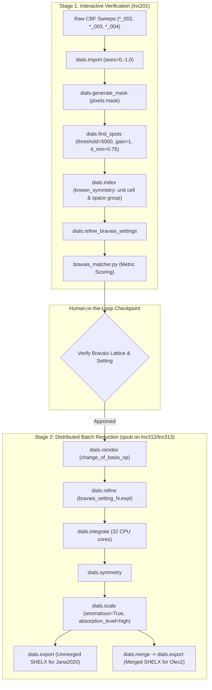

# CHESS DIALS Data Reduction & Crystallographic Refinement Pipeline (`chess-dials-reduction`)

This skill automates the data reduction of single-crystal synchrotron X-ray diffraction datasets collected on the Pilatus 6M detector at the **CHESS ID4B/QM2 beamline** using the **DIALS** (Diffraction Integration for Advanced Light Sources) processing framework.

The output of this pipeline is a dual reflection bundle (`for_refinement/`) containing:
1. **Unmerged SHELX (`unmerged.ins`, `unmerged.hkl`)**: Suitable for **Jana2020** (absorption modeling, twin refinement, modulated structures).
2. **Merged SHELX (`merged.ins`, `merged.hkl`)**: Suitable for **Olex2 / SHELXL** (rapid structure solution and standard least-squares refinement).

---

## 1. Environment & Beamline Prerequisites

### 1.1 Software & Environment
On CLASSE cluster nodes (`lnx201`, `lnx307`, `lnx311`, `lnx312`, `lnx313`), DIALS is installed and activated via:
```bash
source /nfs/chess/sw/dials_sgomezalvarado/dials_env.sh
```
* Python tools must be executed via `dials.python` when interacting with DIALS internal C++ data structures (`scitbx.array_family.flex`, `dxtbx`).

### 1.2 Laboratory Frame & Goniometer Geometry
At CHESS ID4B/QM2 with the Pilatus 6M detector in transmission geometry, the rotation axis in the laboratory coordinate system must be explicitly passed during import:
```text
geometry.goniometer.axes=0,-1,0
```

### 1.3 Cluster Queue & Resource Etiquette
- **Login Node (`lnx201`)**: Used exclusively for lightweight inspection, Stage 1 spot finding, and indexing. Never run heavy parallel integration on `lnx201`.
- **Compute Queues (`all.q@lnx307*`, `lnx311*`, `lnx312*`, `lnx313*`)**: All multi-core integration jobs (`dials.integrate nproc=32`) must be submitted through Sun Grid Engine (`qsub`).

---

## 2. Directory Structure & File Conventions

The DIALS reduction pipeline strictly mirrors the beamline's parallel directory hierarchy:

- **Raw CBF Scans**:
  ```text
  /nfs/chess/id4b/{cycle}/{experiment}/raw6M/{sample_name}/{sample_id}/{temp}/{scan_folder}/
  ```
  *Example:* `/nfs/chess/id4b/2026-2/gomez-al-4850-a/raw6M/K2Co2TeO6/KCTO-1/300/K2Co2TeO6_002/`
- **DIALS Processed Output**:
  ```text
  /nfs/chess/id4baux/{cycle}/{experiment}/dials/{sample_name}/{sample_id}/{temp}/
  ```
  *Example:* `/nfs/chess/id4baux/2026-2/gomez-al-4850-a/dials/K2Co2TeO6/KCTO-1/300/`
- **Beamline Calibrations**:
  ```text
  /nfs/chess/id4baux/{cycle}/{experiment}/calibrations/
  ```
  *Files:* `mask_trans.edf` (bad pixel/beamstop mask), `ceO2_15keV_trans.poni`.
- **Final Refinement Output Folder**:
  ```text
  /nfs/chess/id4baux/{cycle}/{experiment}/dials/{sample_name}/{sample_id}/{temp}/for_refinement/
  ```

---

## 3. Two-Stage Pipeline Architecture



---

## 4. Execution Workflow

### 4.1 Stage 1: Import, Mask, Spotfinding, Indexing, and Bravais Evaluation

Execute interactively on `lnx201` using `orchestrate_dials.py stage1`:

```bash
source /nfs/chess/sw/dials_sgomezalvarado/dials_env.sh

python3 scripts/orchestrate_dials.py stage1 \
    --work-dir /nfs/chess/id4baux/{cycle}/{experiment}/dials/{sample}/{sample_id}/{temp} \
    --raw-dir /nfs/chess/id4b/{cycle}/{experiment}/raw6M/{sample}/{sample_id}/{temp} \
    --goniometer-axes 0,-1,0 \
    --edf-mask /nfs/chess/id4baux/{cycle}/{experiment}/calibrations/mask_trans.edf \
    --gain 1.0 \
    --global-threshold 5000 \
    --d-min 0.75 \
    --unit-cell "a b c alpha beta gamma" \
    --space-group "<SpaceGroup>"
```

#### Under the Hood:
1. **Multi-Sweep Joint Import**:
   Discovers all available scan directories (e.g., `_002`, `_003`, `_004`) and imports them into a unified multi-sweep sequence list:
   ```bash
   dials.import path_to_scan1/*.cbf path_to_scan2/*.cbf path_to_scan3/*.cbf geometry.goniometer.axes=0,-1,0
   ```
2. **Detector Masking**:
   Generates `pixels.mask` using detector module gap geometry and merges with the beamline `mask_trans.edf` mask:
   ```bash
   dials.generate_mask imported.expt output.mask=pixels.mask
   ```
3. **Calibrated Spot Finding**:
   Finds diffraction peak centroids using beamline-calibrated thresholding:
   ```bash
   dials.find_spots find_spots.phil imported.expt mask=pixels.mask spotfinder.filter.d_min=0.75
   ```
4. **Constrained Auto-Indexing**:
   Indexes reflections against the known unit cell and space group:
   ```bash
   dials.index imported.expt strong.refl indexing.known_symmetry.unit_cell="5.21 5.21 13.00 90 90 120" indexing.known_symmetry.space_group="P6322"
   ```
5. **Bravais Setting Scoring**:
   Executes `dials.refine_bravais_settings indexed.expt indexed.refl`, then runs `bravais_matcher.py` to rank settings against the target crystallographic parameters.

---

### 4.2 Human-in-the-Loop Checkpoint: Bravais Selection Gate
Before proceeding to Stage 2, the agent must present the evaluated Bravais table to the user:
```text
Sol  Fit      RMSD   CC           Lattice  Unit Cell                                  cb_op           Score 
---------------------------------------------------------------------------------------------------------------
*12  0.0507   0.089  0.812/0.892  hR       4.76  4.76 12.99  90.0  90.0 120.0       -c,a,-b+c       0.012 
 11  0.0620   0.095  0.750/0.810  oC       ...
```
* **Required Confirmation**: Confirm the target solution setting number (e.g. `12`) and the corresponding change of basis operator (e.g. `-c,a,-b+c` or `a,b,c`).

---

### 4.3 Stage 2: Batch Integration, Scaling, and Dual Export
Submit the heavy compute integration and scaling job to Sun Grid Engine (`qsub`):

```bash
qsub -q 'all.q@lnx307*,all.q@lnx311*,all.q@lnx312*,all.q@lnx313*' \
     -l mem_free=120G -pe sge_pe 32 \
     example_job_scripts/dials-batch-template.sh \
     "/nfs/chess/id4baux/{cycle}/{experiment}/dials/{sample}/{sample_id}/{temp}" \
     "<bravais_setting_number>" \
     "<change_of_basis_op>" \
     "<chemical_composition>"
```

#### Under the Hood:
1. **Reindexing (if necessary)**:
   ```bash
   dials.reindex indexed.refl change_of_basis_op=<cb_op> output.reflections=reindexed.refl
   ```
2. **Refinement of Selected Bravais Model**:
   ```bash
   dials.refine bravais_setting_<N>.expt reindexed.refl
   ```
3. **Multi-Threaded 3D Profile Integration**:
   ```bash
   dials.integrate refined.expt refined.refl nproc=32
   ```
4. **Symmetry Determination**:
   ```bash
   dials.symmetry integrated.expt integrated.refl
   ```
5. **Multi-Sweep Scaling & Absorption Correction**:
   ```bash
   dials.scale symmetrized.expt symmetrized.refl overwrite_existing_models=True absorption_level=high anomalous=True
   ```
6. **Dual SHELX Refinement Bundle Generation**:
   - **Unmerged SHELX (Jana2020)**:
     ```bash
     dials.export scaled.expt scaled.refl format=shelx composition=<comp> shelx.scale=False output.reflections=for_refinement/unmerged.hkl output.experiment=for_refinement/unmerged.ins
     ```
   - **Merged SHELX (Olex2 / SHELXL)**:
     ```bash
     dials.merge scaled.expt scaled.refl output.html=None
     dials.export merged.expt merged.refl format=shelx composition=<comp> shelx.scale=False output.reflections=for_refinement/merged.hkl output.experiment=for_refinement/merged.ins
     ```

---

## 5. Handoff to Refinement Programs

For full GUI import instructions, refer to [`references/jana_olex_import_guide.md`](references/jana_olex_import_guide.md).

- **Jana2020**: Open **New Structure**, select **SHELX format**, and load `for_refinement/unmerged.ins` (which pairs with `unmerged.hkl`). Configure modulation vectors $\mathbf{q}$ or absorption models directly in Jana.
- **Olex2 / SHELXL**: Open `for_refinement/merged.ins` in Olex2, solve using SHELXT, and refine using SHELXL.
