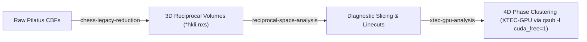

# XTEC-GPU Analysis & Cluster Execution Skill

This skill provides operational procedures, node separation rules, environment configurations, automated 4D dataset compilation via `nxs_analysis_tools.chess.TempDependence.to_xtec()`, and visualization standards for running GPU-accelerated X-ray Temperature Clustering (`XTEC-GPU`) on CHESS/CLASSE computing infrastructure.

---

## 0. QM2 Experimental Lifecycle Navigation

This skill represents the high-dimensional machine learning phase of the QM2 beamline analysis pipeline:



- **Upstream Skills**:
  - [`chess-legacy-reduction`](../chess-legacy-reduction/SKILL.md): Raw frame reduction, scan stacking, headless ORM basinhopping, and 1rot/3rot indexing.
  - [`reciprocal-space-analysis`](../reciprocal-space-analysis/SKILL.md): High-resolution 2D reciprocal space slicing, linecut extraction, and crystallographic visualization.

---

## 1. Remote Cluster Node Topology & Etiquette

Always strictly distinguish between the machine classes on CLASSE:

| Node Role | Host / Queue | Purpose & Hardware | Execution Rule |
| :--- | :--- | :--- | :--- |
| **Login Node** | `lnx201` | Shell management, file editing, git, job dispatch. **No GPU.** | **NEVER run compute**, heavy data loading, or model training here. |
| **Interactive CPU Node** | `interactive.q` | Downstream analysis, `nxs_analysis_tools`, 4D XTEC dataset compilation (`to_xtec`), 3D rotations, PDF compilation. | Access via `qrsh -q interactive.q -l mem_free=350G` from `lnx201`. Python: `/nfs/chess/sw/anaconda3_sgomezalvarado_nightly/bin/python`. |
| **CUDA GPU Node** | `lnx4428` | Heavy ML/clustering, PyTorch, `torchgmm`, GPU preprocessing. **NVIDIA Titan RTX (24 GB VRAM).** | **Submit via Grid Engine: `qsub -l cuda_free=1 <job_script>.sh`.** Python: `/nfs/chess/sw/qm2_XTEC312/bin/python`. |

*Detailed reference:* [Cluster Topology & Execution Guide](./references/cluster_topology.md)

---

## 2. Python Environments & Execution Mechanics

- **Phase 0 Environment (4D Input Generation on `interactive.q`)**:
  - Python interpreter: `/nfs/chess/sw/anaconda3_sgomezalvarado_nightly/bin/python`
  - Utilizes `nxs_analysis_tools.chess.TempDependence.to_xtec()` with lazy loading.
  - Protocol: From `lnx201`, allocate an interactive session:
    ```bash
    qrsh -q interactive.q -l mem_free=350G
    /nfs/chess/sw/anaconda3_sgomezalvarado_nightly/bin/python $HOME/.gemini/config/skills/xtec-gpu-analysis/scripts/generate_xtec_input.py --sample-dir <sample_dir> --output <sample_dir>/xtec_data.nxs
    ```

- **Phases 1–4 Environment (GPU Clustering via `qsub -l cuda_free=1`)**:
  - Python interpreter: `/nfs/chess/sw/qm2_XTEC312/bin/python`
  - CLI binary: `/nfs/chess/sw/qm2_XTEC312/bin/xtec-gpu`
  - **Do NOT use** `/nfs/chess/sw/qm2_XTEC/bin/python` (Python 3.9, which crashes on PEP 604 type unions `X | Y`).
  - Batch Submission via Grid Engine:
    ```bash
    qsub -l cuda_free=1 <job_script>.sh
    ```
    Example job wrapper (see `example_job_scripts/xtec-gpu-clustering.sh`):
    ```bash
    #!/bin/bash
    #$ -S /bin/bash
    #$ -N xtec_gpu
    #$ -cwd
    #$ -j y
    #$ -l cuda_free=1
    #$ -o qsub_xtec.log

    /nfs/chess/sw/qm2_XTEC312/bin/xtec-gpu xtec-d <sample_dir>/xtec_data.nxs -o <output_dir> --min-k 2 --max-k 14
    ```
- **Grid Engine Policy**: All GPU jobs must request GPU resources using `-l cuda_free=1`. Do not run heavy GPU clustering interactively or over direct SSH without queue allocation.

---

## 3. End-to-End XTEC Workflow Pipeline

When a user commands **"Run XTEC on {sample}"**, execute the following lifecycle:

```text
[User Request: "Run XTEC on {sample}"]
                 │
                 ▼
  [Phase 0: Input Verification & Generation]
  ├── 1. Check if <sample_dir>/xtec_data.nxs exists.
  │      └── Found: Proceed directly to Phase 1 (qsub -l cuda_free=1).
  └── 2. Missing: Launch interactive session (qrsh -q interactive.q -l mem_free=350G) to generate 4D input:
         ├── Auto-detect format: NXRefine vs Legacy CHESS
         ├── Load datasets via TempDependence.load_datasets()
         └── Compile 4D volume via TempDependence.to_xtec()
                 │
                 ▼
      [Phase 1: Preprocessing (GPU via qsub -l cuda_free=1)]
      ├── Mask_Zeros (filter dead pixels & gaps)
      └── Threshold_Background (KL-divergence cutoff)
                 │
                 ▼
      [Phase 2: Model Selection (GPU via qsub -l cuda_free=1)]
      ├── BIC Sweep (k = 2 ... 14) Mode 'd' (Direct Voxel GMM)
      ├── BIC Sweep (k = 2 ... 14) Mode 's' (Peak-Averaged GMM)
      └── Minimum / Knee BIC Determination
                 │
                 ▼
      [Phase 3: Clustering & Ordering (GPU via qsub -l cuda_free=1)]
      ├── GMM Training (torchgmm, kmeans++ seed)
      └── Deterministic Sorting (descending low-T intensity)
                 │
                 ▼
      [Phase 4: Visualization & Reporting]
      ├── Discrete Reciprocal-Space Q-Map (pure white background)
      ├── Trajectory & Mean Intensity Plots (synchronized palette)
      └── Comprehensive Markdown Report (absolute image links)
```

### Phase 0 Details: Format Support & Automated Compilation

1. **NXRefine Format**:
   - Layout: Top-level `*_<temp>.nxs` files pointing via `NXlink` to `<temp>/transform.nxs`.
   - Generation:
     ```python
     from nxs_analysis_tools.chess import TempDependence
     td = TempDependence(sample_dir)
     td.find_temperatures()
     td.load_datasets(use_nxlink=True, print_tree=False)
     td.to_xtec(filepath=output_path, overwrite=False)
     ```
2. **Legacy CHESS Format**:
   - Layout: Subdirectories named `<temp>/` containing `*1rot_hkli.nxs`, `*3rot_hkli.nxs`, or `*hkli.nxs`.
   - Generation:
     ```python
     from nxs_analysis_tools.chess import TempDependence
     td = TempDependence(sample_dir)
     td.find_temperatures()
     # Auto-detect file ending pattern (prefers 3rot_hkli.nxs > 1rot_hkli.nxs > hkli.nxs)
     td.load_datasets(file_ending="1rot_hkli.nxs", print_tree=False)
     td.to_xtec(filepath=output_path, overwrite=False)
     ```
3. **Execution Script**:
   - Use the bundled utility: `scripts/generate_xtec_input.py` in an interactive session (`qrsh -q interactive.q -l mem_free=350G`).

*Detailed reference:* [XTEC Workflow Guide](./references/xtec_workflow.md)

---

## 4. Visualization & Reporting Standards

1. **Reciprocal-Space Q-Map**:
   - **Discrete Colors**: Use `matplotlib.colors.ListedColormap` with qualitative palettes (`tab10` / `tab20`). Never use continuous colormaps like `viridis`.
   - **White/Transparent Background**: Initialized with `np.nan` and `cmap.set_bad(color="white", alpha=0.0)`. Unclustered/background voxels must render pure white or transparent.
   - **Discrete Colorbar**: Centered ticks matching cluster IDs $1, 2, \dots, K$ (`BoundaryNorm` with bins $[0.5, 1.5, \dots, K+0.5]$).
   - **Calibrated Axes**: Inherit physical reciprocal lattice coordinates ($H, K$ in r.l.u.) and slice title (e.g. $L = 0.50$).
2. **Trajectory & Intensity Plots**:
   - **Palette Synchronization**: Exactly match the discrete colors used in the Q-map.
   - **Legend Positioning**: Place legends outside the plot area (`bbox_to_anchor=(1.02, 1), loc="upper left"`) so curves are never obscured.
3. **Automated Markdown Reporting (`report.md`)**:
   - **Absolute Image Paths**: Always use absolute paths (e.g. ``) because reports symlinked at workspace roots break when using relative paths.
   - **Cross-Referenced Tables**: Map 1-indexed plot labels (`Cluster 1` to `Cluster K`) to 0-indexed HDF5 datasets in `results.h5`.

---

## 5. Strict Data Safety Policy: NEVER Delete Any `.nxs` Files

> [!CAUTION]
> **Mandatory Data Protection Policy**:
> - **NEVER delete, remove (`rm`, `os.remove`), or truncate any `.nxs` files** under any circumstances.
> - `TempDependence.to_xtec()` defaults to `overwrite=False`. If an input file already exists, verify its integrity and reuse it.
> - If an explicit re-creation or alternative configuration is required, use non-destructive versioning (`xtec_data_1.nxs`, `xtec_data_2.nxs`) rather than replacing or deleting existing datasets.
