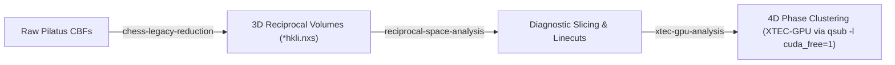

# XTEC-GPU Analysis & Cluster Execution Skill

This skill provides operational procedures, node separation rules, environment configurations, automated 4D dataset compilation via `nxs_analysis_tools.chess.TempDependence.to_xtec()`, and visualization standards for running GPU-accelerated X-ray Temperature Clustering (`XTEC-GPU`) on CHESS/CLASSE computing infrastructure.

---

## 0. QM2 Experimental Lifecycle Navigation

This skill represents the high-dimensional machine learning phase of the QM2 beamline analysis pipeline:



- **Upstream Skills**:
  - [`chess-legacy-reduction`](../chess-legacy-reduction/SKILL.md): Raw frame reduction, scan stacking, headless ORM basinhopping, and 1rot/3rot indexing.
  - [`reciprocal-space-analysis`](../reciprocal-space-analysis/SKILL.md): High-resolution 2D reciprocal space slicing, linecut extraction, and crystallographic visualization.

---

## 1. Remote Cluster Node Topology & Etiquette

Per [`GEMINI.md`](../GEMINI.md), all remote Python and Conda environments on CLASSE are **strictly read-only / immutable**. Never run `pip install` or modify environment configurations.

Always strictly distinguish between the machine classes on CLASSE:

| Node Role | Host / Queue | Purpose & Hardware | Execution Rule |
| :--- | :--- | :--- | :--- |
| **Login Node** | `lnx201` | Shell management, file editing, git, job dispatch. **No GPU.** | **NEVER run compute**, heavy data loading, or model training here. |
| **Interactive CPU Node** | `interactive.q` | Downstream analysis, `nxs_analysis_tools`, 4D XTEC dataset compilation (`to_xtec`), 3D rotations, PDF compilation. | Allocate an interactive shell session: `qrsh -q interactive.q -l mem_free=350G` from `lnx201`. Python: `/nfs/chess/sw/anaconda3_sgomezalvarado_nightly/bin/python`. |
| **Batch CPU Nodes** | `all.q@lnx307*`<br>`all.q@lnx311*`<br>`all.q@lnx312*`<br>`all.q@lnx313*` | Non-interactive data preparation & reduction (200 GB RAM, AVX2 pool). | Non-interactive batch execution via `qsub` (e.g. [`example_job_scripts/xtec-prep-batch.sh`](../example_job_scripts/xtec-prep-batch.sh)). Avoids Kerberos password hangs when running unattended over SSH. |
| **CUDA GPU Node** | `lnx4428` | Heavy ML/clustering, PyTorch, `torchgmm`, GPU preprocessing. **NVIDIA Titan RTX (24 GB VRAM).** | **Submit via Grid Engine: `qsub -l cuda_free=1 <job_script>.sh`.** Python: `/nfs/chess/sw/qm2_XTEC312/bin/python`. |

*Detailed reference:* [Cluster Topology & Execution Guide](./references/cluster_topology.md)

---

## 2. Python Environments, Immutability & Execution Mechanics

### 2.1 Multi-Stage Environment Segregation
- **Phase 0 (4D Input Generation on CPU)**:
  - Python interpreter: `/nfs/chess/sw/anaconda3_sgomezalvarado_nightly/bin/python` (`NIGHTLY_PYTHON`)
  - Uses `nxs_analysis_tools.chess.TempDependence.to_xtec()` with lazy loading.
  - Interactive Mode: `qrsh -q interactive.q -l mem_free=350G` from `lnx201`.
  - Non-Interactive Batch Mode: Submit `qsub example_job_scripts/xtec-prep-batch.sh`.

- **Phases 1–4 (GPU Clustering on `lnx4428`)**:
  - Python interpreter: `/nfs/chess/sw/qm2_XTEC312/bin/python` (`GPU_PYTHON`)
  - CLI binary: `/nfs/chess/sw/qm2_XTEC312/bin/xtec-gpu` (`XTEC_BIN`)
  - **Do NOT use** `/nfs/chess/sw/qm2_XTEC/bin/python` (Python 3.9, which crashes on PEP 604 type unions `X | Y`).
  - Batch Submission via Grid Engine:
    ```bash
    qsub -l cuda_free=1 <job_script>.sh
    ```
    (See [`example_job_scripts/xtec-gpu-clustering.sh`](../example_job_scripts/xtec-gpu-clustering.sh)).

### 2.2 Execution Modalities: Interactive Shells vs. Non-Interactive Batch
- **Interactive Shell Sessions**: When working in a live interactive shell, allocate an interactive compute host with `qrsh -q interactive.q -l mem_free=350G`.
- **Non-Interactive Batch Execution**: When running unattended or programmatic commands over SSH without a connected terminal, `qrsh` halts on Kerberos PAM credential prompts (`Password for <user>@CLASSE.CORNELL.EDU:`). For unattended execution, submit an SGE batch wrapper via `qsub` (e.g. [`example_job_scripts/xtec-prep-batch.sh`](../example_job_scripts/xtec-prep-batch.sh)) and stream stdout/stderr via `tail -f <log>`.

### 2.3 Mandatory "Show-Before-Submit" Verification Gate
> [!IMPORTANT]
> Prior to executing `qsub <job_script>.sh` for any stage (data preparation or GPU clustering), the assistant **MUST present the complete script text to the user**, highlighting queue targets, memory requests, slot allocations, environment path, and CLI invocation. The user must provide confirmation before the job is submitted.

---

## 3. End-to-End XTEC Workflow Pipeline

> [!NOTE]
> **Workflow Independence**: The algorithmic phases of the XTEC workflow (Phases 0 through 4) represent internal machine learning and clustering operations on compiled 4D scattering data. They are **completely unrelated** to the experimental/crystallographic phases in the `chess-legacy-reduction` pipeline.

When a user commands **"Run XTEC on {sample}"**, execute the following lifecycle:

```text
[User Request: "Run XTEC on {sample}"]
                 │
                 ▼
  [Phase 0: Input Verification & Generation (CPU: qrsh or qsub)]
  ├── 1. Check if <sample_dir>/xtec_data.nxs exists.
  │      └── Found: Proceed directly to GPU clustering (qsub -l cuda_free=1).
  └── 2. Missing: Launch data preparation (Interactive: qrsh / Batch: qsub xtec-prep-batch.sh):
         ├── Check sample leaf: nxrefine/{sample_name}/{sample_id} vs processed_old_way/...
         ├── Pre-validate stubs: verify transform.nxs > 0 bytes (skip empty stubs)
         ├── Extract scan exposure times: NeXus logs/T or raw SPEC #T
         ├── Apply modal exposure filter: exclude outlier count times (e.g. parent scans)
         ├── Print ASCII audit summary table
         └── Compile 4D volume via TempDependence.to_xtec()
                 │
                 ▼
  [Autonomous GPU Clustering Pipeline (lnx4428 via qsub -l cuda_free=1)]
  │
  ├── [Phase 1: Preprocessing (GPU with --streamed-preprocess)]
  │   ├── Mask_Zeros (filter dead pixels & gaps)
  │   └── Threshold_Background (KL-divergence cutoff streamed in ~1 GiB slabs)
  │
  ├── [Phase 2: Model Selection (GPU BIC Sweep)]
  │   ├── BIC Sweep across k = 2 ... 14 (xtec-gpu bic-d)
  │   └── Autonomous k* Determination: k* = argmin(BIC) (no manual user intervention required)
  │
  └── [Phase 3: Final Clustering & Ordering (GPU GMM)]
      ├── GMM Training with optimal k* (torchgmm, kmeans++ seed)
      └── Deterministic Sorting by descending low-T intensity (--reorder-clusters)
                 │
                 ▼
  [Phase 4: Visualization & Reporting]
  ├── Discrete Reciprocal-Space Q-Map (tab10/tab20, pure white unclustered, r.l.u. axes)
  ├── Trajectory & Mean Intensity Plots (synchronized palette, legend outside)
  └── Comprehensive Markdown Report (report.md with absolute image links)
```

### Automated Model Selection & GPU Batch Execution (`qsub -l cuda_free=1`)

1. **Autonomous $k^*$ Selection**:
   The user does **not** need to manually inspect the intermediate BIC plot or pause the workflow. The GPU batch job autonomously evaluates the BIC curve, extracts $k^* = \operatorname{argmin}_k \text{BIC}(k)$, and trains the final GMM model within a **single continuous GPU reservation** (see [`example_job_scripts/xtec-gpu-clustering.sh`](../example_job_scripts/xtec-gpu-clustering.sh)).

2. **Mandatory Streamed Preprocessing (`--streamed-preprocess`)**:
   Full 3D synchrotron reciprocal-space temperature series routinely reach 20–50+ GB (e.g., `KV2Se2O` is 48 GB). To prevent CUDA Out-Of-Memory (OOM) errors on the 24 GB Titan RTX, `--streamed-preprocess` **MUST be included** on all `bic-d`, `bic-s`, and `xtec-d` CLI invocations. It streams spatial slabs through memory in ~1 GiB chunks to compute masks and thresholds.

### Phase 0 Details: Format Support, Metadata Verification & Modal Filtering

1. **Pipeline Architecture Detection (Two-Level Sample Hierarchy)**:
   - Samples are organized hierarchically: `/nfs/chess/id4baux/{cycle}/{experiment}/{reduction_pipeline}/{sample_name}/{sample_id}/`.
   - The top-level category (`FeTe2/`) can exist under *both* pipelines simultaneously. Always inspect the specific sample leaf `{sample_name}/{sample_id}/`:
     - **NXRefine** (`nxrefine/{sample_name}/{sample_id}/`): Wrapper files `*_<temp>.nxs` linking to `<temp>/transform.nxs`. Coordinate axes: **`['Ql', 'Qk', 'Qh']`** (Axis 0 = $L$, Axis 1 = $K$, Axis 2 = $H$).
     - **Legacy CHESS** (`processed_old_way/{sample_name}/{sample_id}/`): Subdirectories `<temp>/` containing `*1rot_hkli.nxs`, `*3rot_hkli.nxs`. Coordinate axes: **`['H', 'K', 'L']`** (Axis 0 = $H$, Axis 1 = $K$, Axis 2 = $L$).

2. **Incomplete Stub Pre-Validation**:
   - In `nxrefine`, placeholder wrappers may exist for unreduced temperatures (e.g. 72 MB `.nxs` file), while `<temp>/transform.nxs` is missing or 0 bytes.
   - `generate_xtec_input.py` validates `os.path.isfile(transform_path) and os.path.getsize(transform_path) > 0`, marking empty stubs as `[SKIPPED]` to eliminate broken `NXlink` reads.

3. **Metadata Verification & Modal Exposure Filtering**:
   - Disparate count times (e.g. 15 K parent orientation scan = 365.0 s vs. standard 182.5 s) distort clustering statistics, Poisson noise floors, and cluster boundaries.
   - `generate_xtec_input.py` extracts count times from NeXus (`logs/T`) or raw SPEC data files (`#T`), calculates the modal exposure time, and automatically excludes outlier temperatures (`[EXCLUDED - Exposure Mismatch]`).
   - Displays a structured ASCII audit table detailing candidate status prior to compilation.

4. **Execution Protocol**:
   - **Interactive Shell Sessions**:
     ```bash
     qrsh -q interactive.q -l mem_free=350G
     /nfs/chess/sw/anaconda3_sgomezalvarado_nightly/bin/python $HOME/.gemini/config/skills/xtec-gpu-analysis/scripts/generate_xtec_input.py --sample-dir <sample_dir> --output <sample_dir>/xtec_data.nxs
     ```
   - **Non-Interactive Batch Sessions**:
     Submit [`example_job_scripts/xtec-prep-batch.sh`](../example_job_scripts/xtec-prep-batch.sh) via `qsub` after presenting the script text to the user for confirmation.

*Detailed reference:* [XTEC Workflow Guide](./references/xtec_workflow.md)

---

## 4. Visualization & Reporting Standards

1. **Reciprocal-Space Q-Map**:
   - **Discrete Colors**: Use `matplotlib.colors.ListedColormap` with qualitative palettes (`tab10` / `tab20`). Never use continuous colormaps like `viridis`.
   - **White/Transparent Background**: Initialized with `np.nan` and `cmap.set_bad(color="white", alpha=0.0)`. Unclustered/background voxels must render pure white or transparent.
   - **Discrete Colorbar**: Centered ticks matching cluster IDs $1, 2, \dots, K$ (`BoundaryNorm` with bins $[0.5, 1.5, \dots, K+0.5]$).
   - **Calibrated Axes**: Inherit physical reciprocal lattice coordinates ($H, K$ in r.l.u.) and slice title (e.g. $L = 0.50$).
2. **Trajectory & Intensity Plots**:
   - **Palette Synchronization**: Exactly match the discrete colors used in the Q-map.
   - **Legend Positioning**: Place legends outside the plot area (`bbox_to_anchor=(1.02, 1), loc="upper left"`) so curves are never obscured.
3. **Automated Markdown Reporting (`report.md`)**:
   - **Absolute Image Paths**: Always use absolute paths (e.g. ``) because reports symlinked at workspace roots break when using relative paths.
   - **Cross-Referenced Tables**: Map 1-indexed plot labels (`Cluster 1` to `Cluster K`) to 0-indexed HDF5 datasets in `results.h5`.

---

## 5. Strict Data Safety Policy: NEVER Delete Any `.nxs` Files

> [!CAUTION]
> **Mandatory Data Protection Policy**:
> - **NEVER delete, remove (`rm`, `os.remove`), or truncate any `.nxs` files** under any circumstances.
> - `TempDependence.to_xtec()` defaults to `overwrite=False`. If an input file already exists, verify its integrity and reuse it.
> - If an explicit re-creation or alternative configuration is required, use non-destructive versioning (`xtec_data_1.nxs`, `xtec_data_2.nxs`) rather than replacing or deleting existing datasets.
